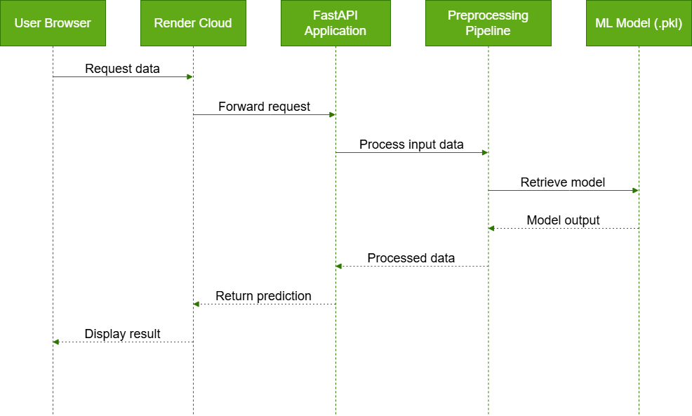
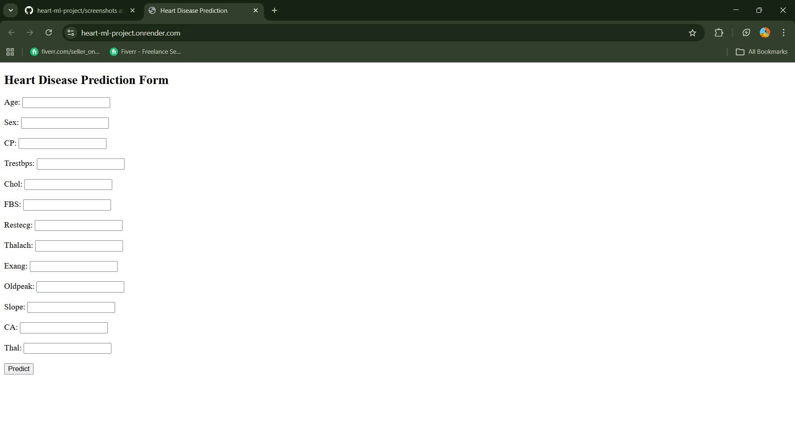
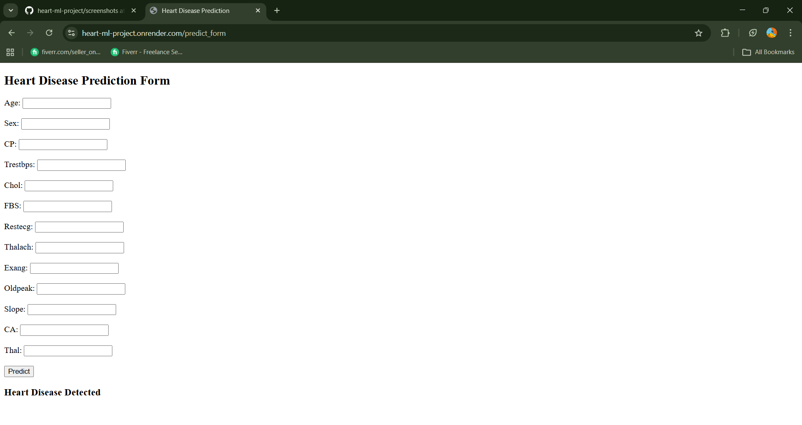
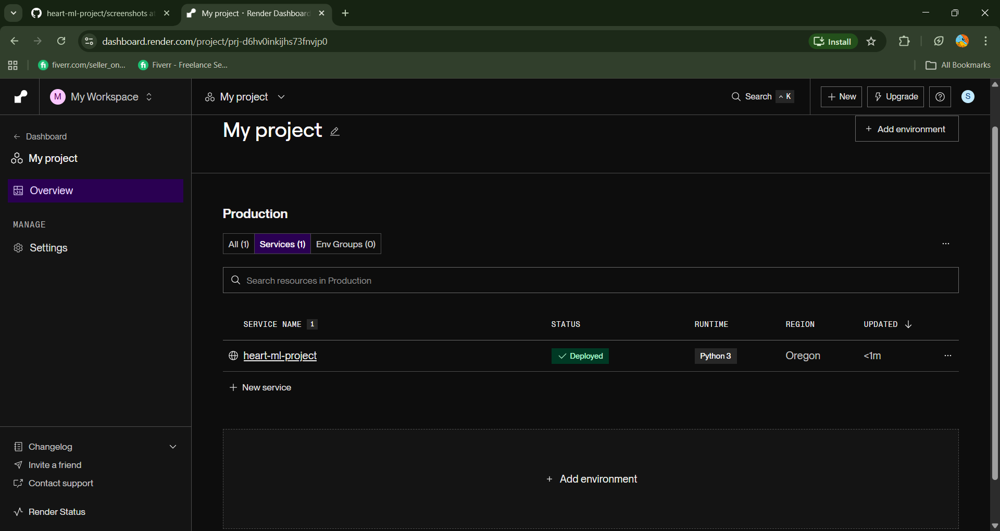

# 🫀 Heart Disease Prediction - ML Web App

## Project Overview

This is a Machine Learning web application that predicts the likelihood of heart disease based on medical input features.

The application is built using FastAPI, integrated with a trained Scikit-learn model, and deployed on Render. Docker is used for local containerization.

---

## 🛠 Tech Stack

- Python 3.11
- FastAPI
- Scikit-learn
- Pandas
- Jinja2 (Templates)
- Uvicorn
- Docker (Local Containerization)
- Render (Cloud Deployment)

---

## 🧠 Machine Learning Model

- Algorithm: Random Forest
- Preprocessing:
  - StandardScaler
  - ColumnTransformer
  - OneHotEncoder
- Model saved using `joblib`

---

## 🏗 Architecture Diagram

---

## 🌍 Live Deployment

🔗 Live Application:
https://heart-ml-project.onrender.com

---

## 🐳 Docker (Local Setup)

Build Docker image:

docker build -t ml-app .

Run Docker container:

docker run -p 8000:8000 ml-app

Access locally:

http://localhost:8000

---

## Screenshots

### 🖥 Web Form

### 📊 Prediction Result

### Render Deployment

---

## 📚 What I Learned

- Building ML APIs using FastAPI
- Integrating trained models into production
- Managing dependencies and environment versions
- Cloud deployment on Render
- Docker containerization
- Debugging deployment errors

---

## 👨‍💻 Author

Satheesh
